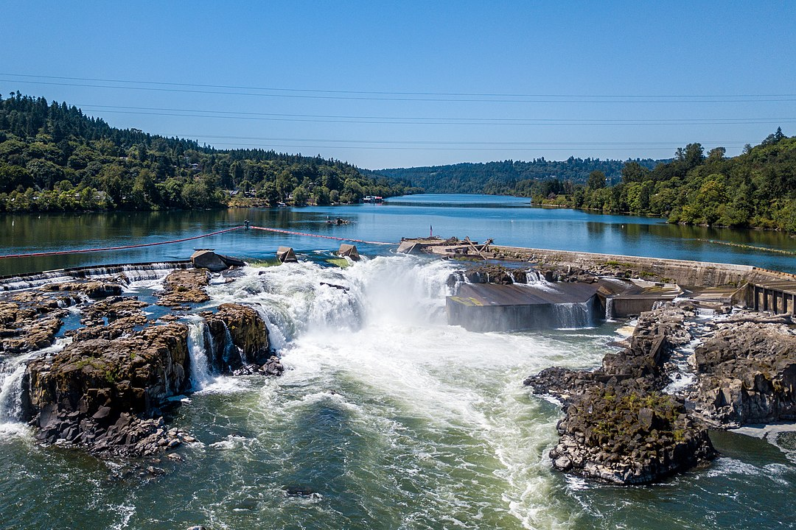

```{r setup, include=FALSE, message=FALSE, warning=FALSE}
knitr::opts_chunk$set(echo = TRUE)
library(prettydoc)
library(tidyverse)
library(dplyr)
library(here)
library(janitor)
library(lubridate)
library(tsibble)
library(feasts)
library(patchwork)
library(viridis)
```

# Overview {.tabset}


**Willamette Falls as seen from overhead via a drone in July 2017. Photo:By Mrgadget51 - Own work, CC BY-SA 4.0**

The Niagara of the West - Willamette Falls is the largest falls in Oregon. The river was once filled with salmon and Pacific lamprey and for thousands of years this area was a significant fishing place for the Clackamas People. Close contact with early European fur traders had devastating effects on the Clackamas People and by 1851 nearly 97% of the Native people in this area had died from foreign diseases ([Lewis, 2014](https://ndnhistoryresearch.com/2014/12/15/clackamas-people-of-willamette-falls/#:~:text=The%20Clackamas%20People%20helped%20early,south%20into%20the%20Willamette%20Valley.&text=Willamette%20Falls%20was%20the%20main,or%20leap%20over%20the%20falls.)). 

Since 1961, Oregon Department of Fish & Wildlife has recorded the monthly fish passage through Willamette Falls fishway.  Counts are conducted 24 hrs/day, 365 days/year using using video cameras and time lapsed video recorders at the main viewing window.
  
  Here is a map of the fish ladder location!
  
  **Data Citation:** Adult Passage Inventory Willamette Falls. Oregon Department of Fish & Wildlife, Columbia River DART (Data access in Real Time), 2000-2020. [http://www.cbr.washington.edu/dart/query/adult_graph_text](http://www.cbr.washington.edu/dart/query/adult_graph_text) 

## Tab 1: Original time series 

As shown in the figure below: 

 *  Steelhead salmon had a large presence in 2001 (approx. 400 fish per day), while Coho and Jack Coho salmon did not appear in the passage during 2001 (zero fish per day).
 *  The recorded number of Coho fish increased as time increased, with the most recorded Coho salmon in 2010.
 *  There is a constant trended in the recorded number of Jack Coho, except for a peak in late 2008. 
 *  All three fish seem to have a seasonal trend, where some months have more recorded salmon than others. For example, more Steelhead salmon are found during the Spring months. 
```{r,  message=FALSE, warning=FALSE}
original_ts <- read_csv(here("data","willamette_fish_passage.csv")) %>% 
  clean_names() %>% 
  select(coho, jack_coho, steelhead, date) %>%
  replace(is.na(.), 0) %>% 
  mutate(date = mdy(date)) %>% 
  as_tsibble(key = NULL, index = date)

static_coho <- original_ts %>% 
  ggplot(aes(x = date, y = coho)) +
  labs(subtitle = 'Coho', x ='', y='') +
  geom_line() +
  theme_dark()

static_jackcoho <- original_ts %>% 
  ggplot(aes(x = date, y = jack_coho)) +
  labs(subtitle = 'Jack Coho', x ='', y='') +
  geom_line() +
  theme_dark()

static_steelhead <- original_ts %>% 
  ggplot(aes(x = date, y = steelhead)) +
  labs(subtitle = 'Steelhead', x ='', y='') +
  geom_line() +
  theme_dark()


(static_coho / static_jackcoho / static_steelhead) +
  plot_layout(guides = 'collect') +
  plot_annotation(title = 'Species Counts at Willamette Falls (2001-2010)', subtitle = 'Adult Passage (fish/day)', caption = 'Figure 1. Static graph of passage recorded for Coho, Jack Coho, and Steelhead salmon.') 
  
```


## Tab 2: Seasonplots

```{r, warning=FALSE, message = FALSE}
seasonplot_ts <- read_csv(here("data","willamette_fish_passage.csv")) %>% 
  clean_names() %>% 
  select(coho, jack_coho, steelhead, date, temp_c) %>%
  mutate(date = mdy(date)) %>% 
  as_tsibble(key = NULL, index = date)

seasonplot_week <- seasonplot_ts %>% 
  index_by(yr_wk = ~yearweek((.))) %>% 
  summarize(weekly_steelhead_counts = mean(steelhead), weekly_coho_counts = mean(coho), weekly_jack_coho_counts = mean(jack_coho)) 

steelhead <- seasonplot_week %>% 
  gg_season(y = weekly_steelhead_counts,
            pal = magma(10)) +
  theme_dark() +
  theme(axis.title = element_blank())

coho <- seasonplot_week %>% 
  gg_season(y = weekly_coho_counts,
            pal = magma(10)) +
  theme_dark() +
  theme(axis.title = element_blank())

jack_coho <- seasonplot_week %>% 
  gg_season(y = weekly_jack_coho_counts,
            pal = magma(10)) +
  theme_dark() +
  theme(axis.title = element_blank())

steelhead + labs(subtitle = 'Steelhead') + 
  (jack_coho + labs(subtitle = 'Jack Coho') + 
     coho + labs(subtitle = 'Coho') +
     plot_layout(ncol = 1)) +
  plot_layout(guides = 'collect') +
  plot_annotation(title = 'Species Counts at Willamette Falls (2001-2010)') &
  theme(legend.position = 'bottom')
```


## Tab 3: Annual counts by species

```{r, warning=FALSE, message = FALSE}

annual_ts <- read_csv(here("data","willamette_fish_passage.csv")) %>% 
  clean_names() %>% 
  select(coho, jack_coho, steelhead, date, temp_c) %>%
  mutate(date = mdy(date))%>% 
  as_tsibble(key = NULL, index = date)

annual_counts <- annual_ts %>% 
  index_by(yearly = ~year(.)) %>% 
  summarize(count_coho = sum(coho, na.rm = TRUE),
            count_jack = sum(jack_coho, na.rm = TRUE),
            count_steelhead = sum(steelhead, na.rm = TRUE)) 

ggplot(annual_counts)+
  geom_line(aes(x = yearly, y = count_coho),
            color = "cyan3")+
  geom_line(aes(x = yearly, y = count_jack),
            color = "darkgoldenrod1")+
  geom_line(aes(x = yearly, y = count_steelhead),
            color = "darkgreen")+
  scale_x_continuous(breaks = c(2001:2010))+
  labs(x = "Year", y = "Total adult passage")+
  ggtitle(label = "Total Annual Passage by Species")+
  geom_label(label = "Steelhead", x=2005.5, y=40000, color = "darkgreen") +
  geom_label(label = "Jack-Coho", x=2009, y=5500, color = "darkgoldenrod1") +
  geom_label(label = "Coho", x =2005, y = 8000, color = "cyan3")
    
```

